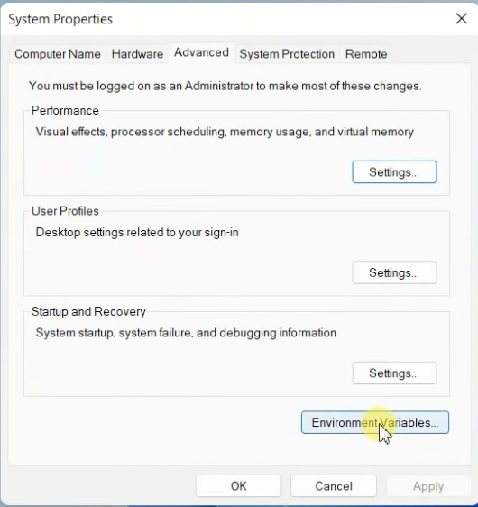
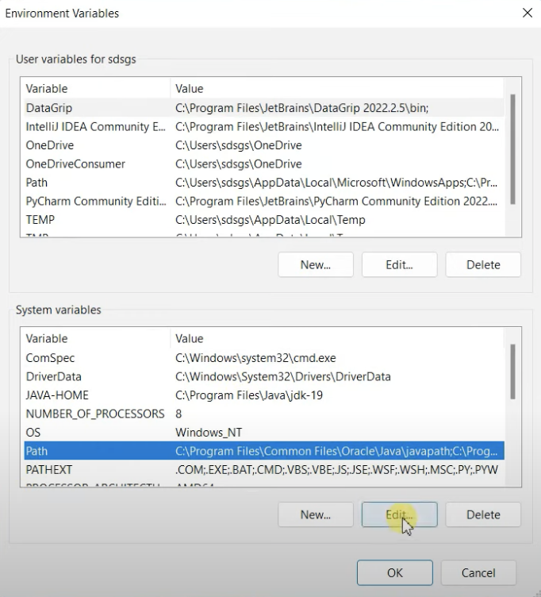
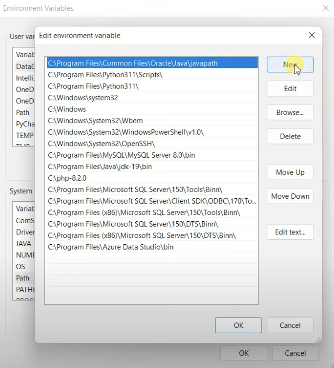

# DashboardModel

## 1. Install C complier MinGW w64 on Windows 10 [^1]

### 1.1 Download compiler from [MinGW](https://sourceforge.net/projects/mingw/)
Click on the download button and it's going to start downloading within 5 seconds. 

After finish downloading, go to the download folder, click on `mingw-get-setup.exe` setup file and you'll see the installation wizard. 

Click on `Install` -> `Continue` and wait for everything gets download. 

After all the files and folders are downloaded, click on `Continue` button and it's going to show a **MinGW Installation Manager** window. Mark all the file for installation and click on `Installation` -> `Apply Changes` -> `Apply`, it will start downloading again.

### 1.2 Set up our environment variable

Go to the **MinGW** folder you created, and then you'll see **bin** folder. Click on the address bar and copy the path which is probably `C:\MinGW\bin`.

Search with **Edit the system environment variables** and open it, you'll see the **System Properties** window.

Click on `EnvironmentVariables` -> `Path` -> `Edit...` -> `New` and paste your
`C:\MinGW\bin` path -> `OK`.





### Checking the compiler
Open the `Command Prompt`.
```
g++ version
```

[^1]: https://www.youtube.com/watch?v=FEeFG9OR-QU&t=37s